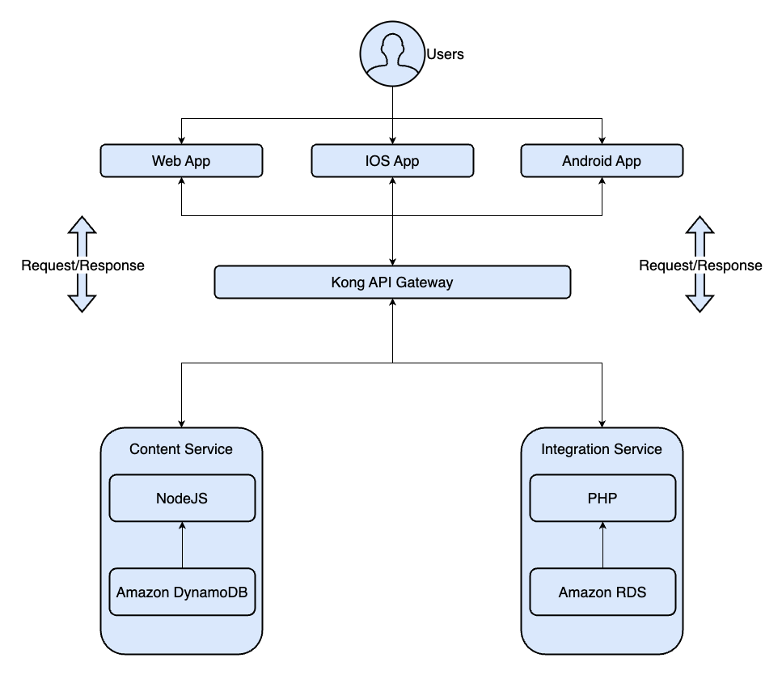

# Postgres Mode

## This project is a starter kit for kong api gateway, It is intended to work with db mode of postgres.

### Run `docker-compose up -d` command to execute application.

* [Application API Endpoint](http://localhost:8000/)
* [Admin API Endpoint](http://localhost:8001/)
* [Admin Dashboard](http://localhost:8002/)
* [Dev Portal Dashboard](http://localhost:8003/)

### Architecture Sample

